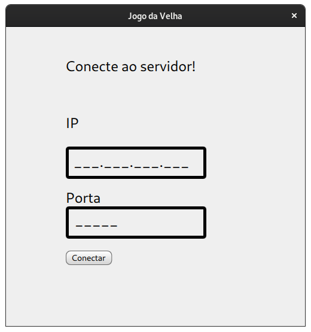
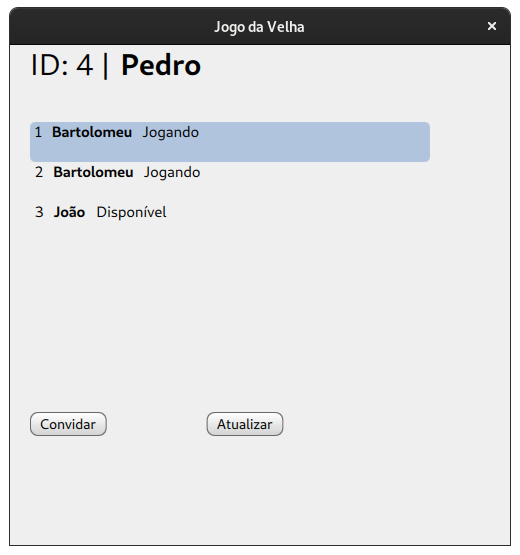
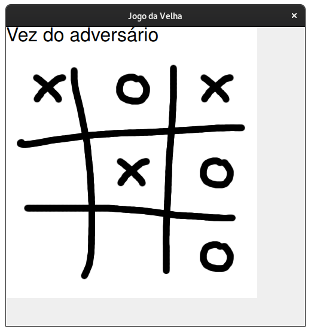

# Relatório do projeto final de Redes de Computadores I

Aluno: **João Victor Marques de Oliveira**

Nº USP: **9344790**

## Objetivo do projeto

O projeto consiste em implementar um jogo da velha numa aplicação cliente-servidor.

O cliente é somente responsável pela interface gráfica. O servidor contém a lógica de jogo e de comunicação com outros jogadores.

### Descrição e Organização do projeto

O projeto foi feito em [python 3](https://www.python.org/download/releases/3.0/). As mensagens entre os clientes e o servidor foram em formato [JSON](https://www.json.org/json-en.html).

O projeto está disponível em um [repositório público no github](https://github.com/jv-oliveira/Tictactoe_client_server).

#### Organização dos diretórios

.
├── client \
│   ├── local_game_manager.py \
│   ├── PlayerListModel.py \
│   └── server_comm.py \
├── images \
│   ├── board.png \
│   ├── o.png \
│   └── x.png \
├── LICENSE \
├── qml \
│   ├── AcceptInviteForm.ui.qml \
│   ├── AcceptInvite.qml \
│   ├── app.qml \
│   ├── Button.qml \
│   ├── CarregandoListaForm.ui.qml \
│   ├── CarregandoLista.qml \
│   ├── EsperandoJogadorForm.ui.qml \
│   ├── EsperandoJogador.qml \
│   ├── OXBox.qml \
│   ├── PlayerListForm.ui.qml \
│   ├── PlayerList.qml \
│   ├── PlayerNameForm.ui.qml \
│   ├── PlayerName.qml \
│   ├── ServerForm.ui.qml \
│   ├── tictactoe.js \
│   └── TicTacToe.qml \
├── server \
│   ├── game_session_manager.py \
│   ├── game_session.py \
│   ├── player.py \
│   ├── server_request_handler.py \
│   └── session_manager.py \
├── tictactoegame.py \
└── tictactoe_server.py \

4 directories, 30 files

### Servidor

O servidor foi feito em python utilizando a biblioteca [http.server](https://docs.python.org/3/library/http.server.html). Foram feitas cinco classes para sua lógica.

- *GameSession*: administra e contém informações sobre uma partida
- *GameSessionManager*: administra as partidas em execução
- *Player*: representa um jogador que se conectou ao servidor
- *SessionManager*: administra as autenticações de cada conexão com o servidor
- *ServerRequestHandler*: lida com as requisições HTTP do servidor


#### Endpoints

O servidor possui endpoints para cada tipo de operação e commando que o cliente desejar requisitar.

Os headers obrigatórios para as comunicações sao:
- Authorization: token (excepto para POST /login )
- Content-Type: application/json
- Content-Length

#### POST
- */login*: 

Adquirir um novo token de conecção com o servidor

Request Body
```json
{
	"player_name": "Bartolomeu"
}
```
Response Body
```json
{
    "session": "mbhmKJLqBzQ2N94mDX2S6xXaAtG0oo1u",
    "player_id": 1
}
```
- */requestGame*: 

Realizar convite de partida a outro usuário

Request Body
```json
{
	"invitor_id": 1,
	"inviting_id": 2
}
```
Response Body
```json
{}
```
- */invitation*: 

confirmar aceitação de um convite

Request Body
```json
{
	"player_id": 1,
	"accepted": true
}
```
Response Body
```json
{
    "session": {
        "session_id": 1,
        "winner": null,
        "turn": 1,
        "session_choices": [
            null,
            null,
            null,
            null,
            null,
            null,
            null,
            null,
            null
        ]
    }
}
```
- */gameSessionActive*: 

Verificar se um jogador possui uma sessão ativa

Request Body
```json
{
    "player_id": 1,
    "quit": true
}
```
Response Body
```json
{}
```
- */quit*: 

Abandonar partida

Request Body
```json
{
	"player_name": "Bartolomeu"
}
```
Response Body
```json
{
    "session": "mbhmKJLqBzQ2N94mDX2S6xXaAtG0oo1u",
    "player_id": 1
}
```
- */makeMove*: 

Realizar Jogada. O index_id corresponde ao seguinte no jogo da velha:
```
| | | |           |0|1|2|
-------           -------
| |O|X|  -->      |3|4|5|
-------           -------
|X| | |           |6|7|8|

```

Request Body
```json
{
	"game_session": 1,
	"player_id": 1,
	"index_id": 7
}
```
Response Body
```json
{
    "session": "mbhmKJLqBzQ2N94mDX2S6xXaAtG0oo1u",
    "player_id": 1
}
```

##### GET

- */players*: 

Response Body
```json
{
    "players_count": 1,
    "players": [
        {
            "id": 1,
            "name": "Bartolomeu",
            "gamingState": 0
        }
    ]
}
```
- */invitation*: 

Request Body
```json
{
	"player_id": 1
}
```
Response Body
```json
{
    "invitor": {
        "id": 1,
        "name": "Bartolomeu"
    }
} 
```
- */gameSessionActive*: 

Request Body
```json
{
	"player_id": 1
}
```
Response Body
```json
{
    "session": {
        "session_id": 1,
        "winner": null,
        "turn": 1,
        "session_choices": [
            null,
            null,
            null,
            null,
            null,
            null,
            null,
            null,
            null
        ]
    }
}
```
- */gameSessionStatus*: 

Request Body
```json
{
	"session_id": 1
}
```
Response Body
```json
{
    "session": {
        "session_id": 1,
        "winner": null,
        "turn": 2,
        "session_choices": [
            null,
            null,
            null,
            null,
            "X",
            null,
            "O",
            "X",
            null
        ]
    }
}
```

### Cliente

O cliente foi feito em python 3 utilizando a biblioteca [http.client](https://docs.python.org/3/library/http.client.html). A GUI (*Graphic User Interface**) foi feita com [PyQt5 5.13.2](https://www.riverbankcomputing.com/software/pyqt/intro). A modelagem das telas é feita por arquivos [QML (Qt Modeling Language)](https://doc.qt.io/qt-5/qmlreference.html).

Foram feitas três classes para sua lógica.

- LocalGameManager: contém e administra informações sobre o jogo local
- PlayerListModel: classe de GUI para mostrar uma lista de jogadores conectados no servidor
- ServerComm: contém a lógica de requests para o servidor


#### GUI - Interface gráfica de usuário

##### Tela inicial



##### Lista de Jogadores

##### Jogo


### Configuração de pacotes

Para poder executar o script python do projeto, é necessário instalar alguns pacotes do python.

```shell
$ sudo pip install PyQt5
$ sudo pip install PyQt5-sip
$ sudo pip install timeloop
$ sudo pip install netaddr
```

### Execução

O programa foi feito e tedtado em:
- OS: GNU/LINUX
- distro: Arch Linux
- Arch: x86_64 
- kernel: 5.4.2

#### Servidor
```shell
$ python3 tictactoe_server.py -h 192.168.0.12 -p 65432

serving at 192.168.0.12:65432
```

#### Cliente
```shell
$ python3 tictactoegame.py
```


